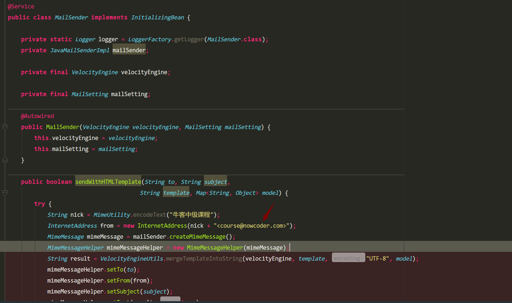
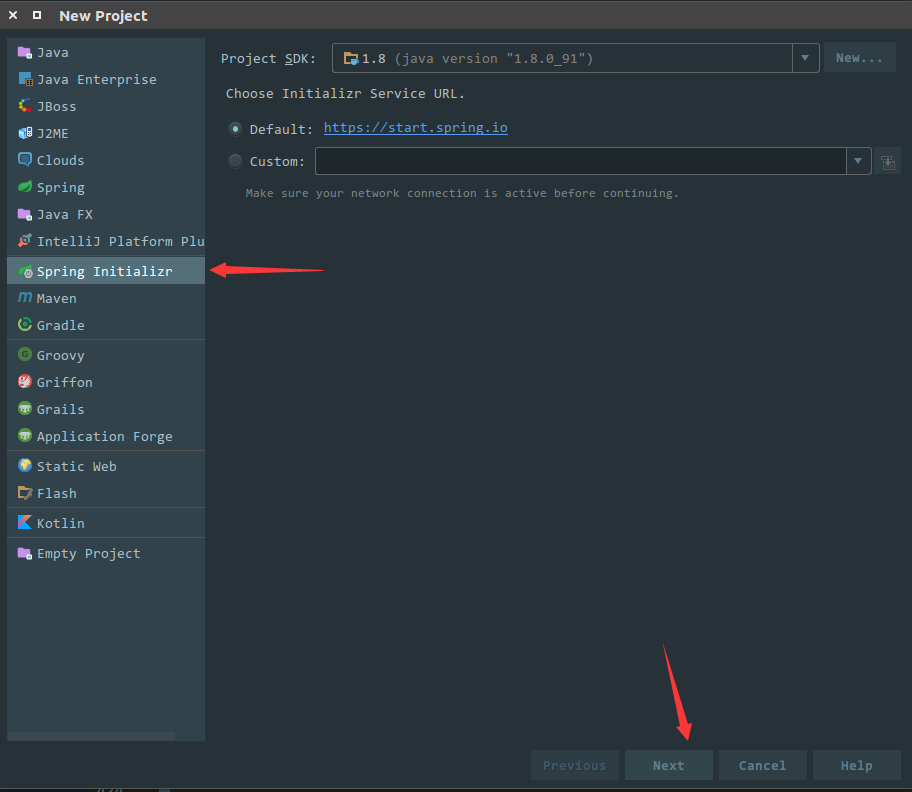
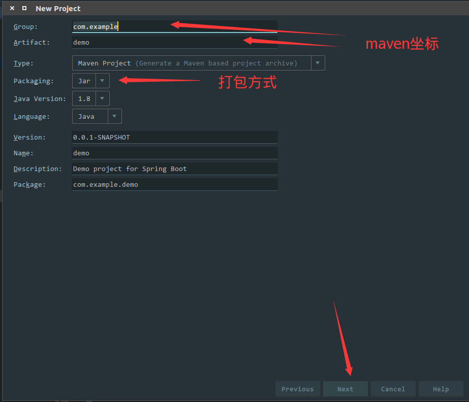
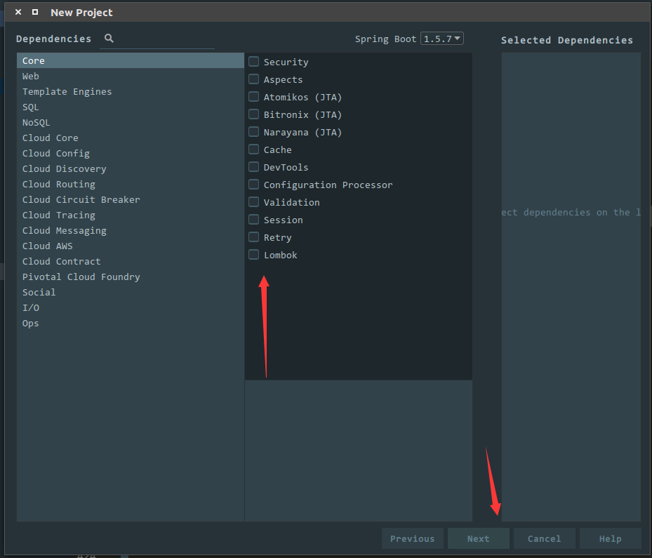
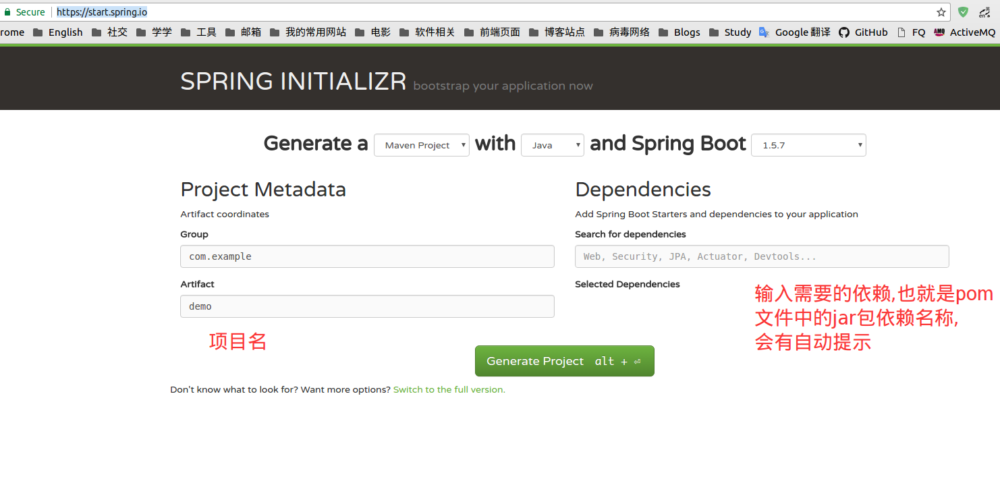
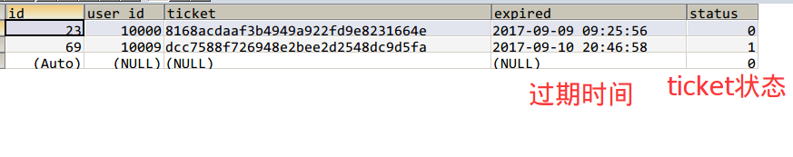
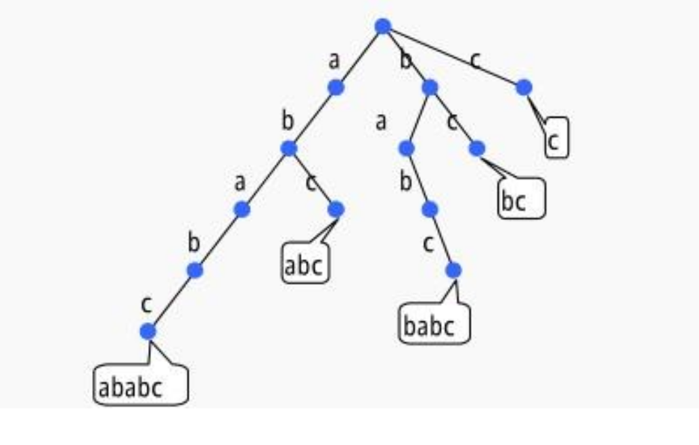

# wenda
使用SSM框架搭建仿知乎问答社区


## 项目的来源
  项目来源自国内知名刷题网站的项目,主要是给在校的学生一个更加真实的实战项目,非经验,有些东西不是自己独立在实践生产中写的东西只能说是一种经历,但是比起书本上的项目的话确实挺值的.
  
## 项目环境搭建
  * **操作系统** : Ubuntu 17.04 
  * **IDE** ：IntelliJ IDEA 2017.1.3 x64 && Pycharm 2017.1.1
  * **JDK Version** : JDK1.8 建议使用JDK1.7以上版本
  * **Python Version** : Python 2.7
  * **Web容器** ： SpringBoot集成的默认容器-Tomcat
  * **数据库** ：Mysql-5.7    
  * **依赖管理工具** : Maven  管理jar包真的很方便
  * **版本控制**: Git

## 项目的运行
### 下载  

`Download Zip`或者 `git clone`
``` shell
	git clone https://github.com/Sunybyjava/wenda.git
```
### 导入到IDE  
使用`IDEA`创建的项目,配置好`maven`的相关配置,以及项目`JDK`版本,直接在主界面选择`Open`,然后找到项目所在路径,点击导入就可以了


##项目问题总结  
### 1.启动项目时Spring报错
 ````
 /opt/jdk/1.8/bin/java -javaagent:/opt/idea-IU-171.4249.39/lib/idea_rt.jar=41203:/opt/idea-IU-171.4249.39/bin -Dfile.encoding=UTF-8 -classpath /opt/jdk/1.8/jre/lib/charsets.jar:/opt/jdk/1.8/jre/lib/deploy.jar:/opt/jdk/1.8/jre/lib/ext/cldrdata.jar:/opt/jdk/1.8/jre/lib/ext/dnsns.jar:/opt/jdk/1.8/jre/lib/ext/jaccess.jar:/opt/jdk/1.8/jre/lib/ext/jfxrt.jar:/opt/jdk/1.8/jre/lib/ext/localedata.jar:/opt/jdk/1.8/jre/lib/ext/nashorn.jar:/opt/jdk/1.8/jre/lib/ext/sunec.jar:/opt/jdk/1.8/jre/lib/ext/sunjce_provider.jar:/opt/jdk/1.8/jre/lib/ext/sunpkcs11.jar:/opt/jdk/1.8/jre/lib/ext/zipfs.jar:/opt/jdk/1.8/jre/lib/javaws.jar:/opt/jdk/1.8/jre/lib/jce.jar:/opt/jdk/1.8/jre/lib/jfr.jar:/opt/jdk/1.8/jre/lib/jfxswt.jar:/opt/jdk/1.8/jre/lib/jsse.jar:/opt/jdk/1.8/jre/lib/management-agent.jar:/opt/jdk/1.8/jre/lib/plugin.jar:/opt/jdk/1.8/jre/lib/resources.jar:/opt/jdk/1.8/jre/lib/rt.jar:/home/sunjianrong/IdeaProjects/wenda/target/classes:/home/sunjianrong/.m2/repository/org/springframework/boot/spring-boot-starter-aop/1.3.6.RELEASE/spring-boot-starter-aop-1.3.6.RELEASE.jar:/home/sunjianrong/.m2/repository/org/springframework/boot/spring-boot-starter/1.3.6.RELEASE/spring-boot-starter-1.3.6.RELEASE.jar:/home/sunjianrong/.m2/repository/org/springframework/boot/spring-boot-starter-logging/1.3.6.RELEASE/spring-boot-starter-logging-1.3.6.RELEASE.jar:/home/sunjianrong/.m2/repository/ch/qos/logback/logback-classic/1.1.7/logback-classic-1.1.7.jar:/home/sunjianrong/.m2/repository/ch/qos/logback/logback-core/1.1.7/logback-core-1.1.7.jar:/home/sunjianrong/.m2/repository/org/slf4j/slf4j-api/1.7.21/slf4j-api-1.7.21.jar:/home/sunjianrong/.m2/repository/org/slf4j/jcl-over-slf4j/1.7.21/jcl-over-slf4j-1.7.21.jar:/home/sunjianrong/.m2/repository/org/slf4j/jul-to-slf4j/1.7.21/jul-to-slf4j-1.7.21.jar:/home/sunjianrong/.m2/repository/org/slf4j/log4j-over-slf4j/1.7.21/log4j-over-slf4j-1.7.21.jar:/home/sunjianrong/.m2/repository/org/yaml/snakeyaml/1.16/snakeyaml-1.16.jar:/home/sunjianrong/.m2/repository/org/springframework/spring-aop/4.2.7.RELEASE/spring-aop-4.2.7.RELEASE.jar:/home/sunjianrong/.m2/repository/aopalliance/aopalliance/1.0/aopalliance-1.0.jar:/home/sunjianrong/.m2/repository/org/springframework/spring-beans/4.2.7.RELEASE/spring-beans-4.2.7.RELEASE.jar:/home/sunjianrong/.m2/repository/org/aspectj/aspectjweaver/1.8.9/aspectjweaver-1.8.9.jar:/home/sunjianrong/.m2/repository/org/mybatis/spring/boot/mybatis-spring-boot-starter/1.3.0/mybatis-spring-boot-starter-1.3.0.jar:/home/sunjianrong/.m2/repository/org/springframework/boot/spring-boot-starter-jdbc/1.3.6.RELEASE/spring-boot-starter-jdbc-1.3.6.RELEASE.jar:/home/sunjianrong/.m2/repository/org/apache/tomcat/tomcat-jdbc/8.0.36/tomcat-jdbc-8.0.36.jar:/home/sunjianrong/.m2/repository/org/apache/tomcat/tomcat-juli/8.0.36/tomcat-juli-8.0.36.jar:/home/sunjianrong/.m2/repository/org/springframework/spring-jdbc/4.2.7.RELEASE/spring-jdbc-4.2.7.RELEASE.jar:/home/sunjianrong/.m2/repository/org/springframework/spring-tx/4.2.7.RELEASE/spring-tx-4.2.7.RELEASE.jar:/home/sunjianrong/.m2/repository/org/mybatis/spring/boot/mybatis-spring-boot-autoconfigure/1.3.0/mybatis-spring-boot-autoconfigure-1.3.0.jar:/home/sunjianrong/.m2/repository/org/mybatis/mybatis/3.4.4/mybatis-3.4.4.jar:/home/sunjianrong/.m2/repository/org/mybatis/mybatis-spring/1.3.1/mybatis-spring-1.3.1.jar:/home/sunjianrong/.m2/repository/org/springframework/boot/spring-boot-starter-web/1.3.6.RELEASE/spring-boot-starter-web-1.3.6.RELEASE.jar:/home/sunjianrong/.m2/repository/org/springframework/boot/spring-boot-starter-tomcat/1.3.6.RELEASE/spring-boot-starter-tomcat-1.3.6.RELEASE.jar:/home/sunjianrong/.m2/repository/org/apache/tomcat/embed/tomcat-embed-core/8.0.36/tomcat-embed-core-8.0.36.jar:/home/sunjianrong/.m2/repository/org/apache/tomcat/embed/tomcat-embed-el/8.0.36/tomcat-embed-el-8.0.36.jar:/home/sunjianrong/.m2/repository/org/apache/tomcat/embed/tomcat-embed-logging-juli/8.0.36/tomcat-embed-logging-juli-8.0.36.jar:/home/sunjianrong/.m2/repository/org/apache/tomcat/embed/tomcat-embed-websocket/8.0.36/tomcat-embed-websocket-8.0.36.jar:/home/sunjianrong/.m2/repository/org/springframework/boot/spring-boot-starter-validation/1.3.6.RELEASE/spring-boot-starter-validation-1.3.6.RELEASE.jar:/home/sunjianrong/.m2/repository/org/hibernate/hibernate-validator/5.2.4.Final/hibernate-validator-5.2.4.Final.jar:/home/sunjianrong/.m2/repository/javax/validation/validation-api/1.1.0.Final/validation-api-1.1.0.Final.jar:/home/sunjianrong/.m2/repository/org/jboss/logging/jboss-logging/3.3.0.Final/jboss-logging-3.3.0.Final.jar:/home/sunjianrong/.m2/repository/com/fasterxml/classmate/1.1.0/classmate-1.1.0.jar:/home/sunjianrong/.m2/repository/com/fasterxml/jackson/core/jackson-databind/2.6.7/jackson-databind-2.6.7.jar:/home/sunjianrong/.m2/repository/com/fasterxml/jackson/core/jackson-annotations/2.6.7/jackson-annotations-2.6.7.jar:/home/sunjianrong/.m2/repository/com/fasterxml/jackson/core/jackson-core/2.6.7/jackson-core-2.6.7.jar:/home/sunjianrong/.m2/repository/org/springframework/spring-web/4.2.7.RELEASE/spring-web-4.2.7.RELEASE.jar:/home/sunjianrong/.m2/repository/org/springframework/spring-context/4.2.7.RELEASE/spring-context-4.2.7.RELEASE.jar:/home/sunjianrong/.m2/repository/org/springframework/spring-webmvc/4.2.7.RELEASE/spring-webmvc-4.2.7.RELEASE.jar:/home/sunjianrong/.m2/repository/org/springframework/spring-expression/4.2.7.RELEASE/spring-expression-4.2.7.RELEASE.jar:/home/sunjianrong/.m2/repository/org/springframework/boot/spring-boot-starter-velocity/1.3.6.RELEASE/spring-boot-starter-velocity-1.3.6.RELEASE.jar:/home/sunjianrong/.m2/repository/commons-beanutils/commons-beanutils/1.9.2/commons-beanutils-1.9.2.jar:/home/sunjianrong/.m2/repository/commons-collections/commons-collections/3.2.2/commons-collections-3.2.2.jar:/home/sunjianrong/.m2/repository/commons-digester/commons-digester/2.1/commons-digester-2.1.jar:/home/sunjianrong/.m2/repository/org/apache/velocity/velocity/1.7/velocity-1.7.jar:/home/sunjianrong/.m2/repository/commons-lang/commons-lang/2.4/commons-lang-2.4.jar:/home/sunjianrong/.m2/repository/org/apache/velocity/velocity-tools/2.0/velocity-tools-2.0.jar:/home/sunjianrong/.m2/repository/commons-chain/commons-chain/1.1/commons-chain-1.1.jar:/home/sunjianrong/.m2/repository/commons-validator/commons-validator/1.3.1/commons-validator-1.3.1.jar:/home/sunjianrong/.m2/repository/dom4j/dom4j/1.1/dom4j-1.1.jar:/home/sunjianrong/.m2/repository/oro/oro/2.0.8/oro-2.0.8.jar:/home/sunjianrong/.m2/repository/sslext/sslext/1.2-0/sslext-1.2-0.jar:/home/sunjianrong/.m2/repository/org/apache/struts/struts-core/1.3.8/struts-core-1.3.8.jar:/home/sunjianrong/.m2/repository/antlr/antlr/2.7.7/antlr-2.7.7.jar:/home/sunjianrong/.m2/repository/org/apache/struts/struts-taglib/1.3.8/struts-taglib-1.3.8.jar:/home/sunjianrong/.m2/repository/org/apache/struts/struts-tiles/1.3.8/struts-tiles-1.3.8.jar:/home/sunjianrong/.m2/repository/org/springframework/spring-context-support/4.2.7.RELEASE/spring-context-support-4.2.7.RELEASE.jar:/home/sunjianrong/.m2/repository/org/springframework/boot/spring-boot-devtools/1.3.6.RELEASE/spring-boot-devtools-1.3.6.RELEASE.jar:/home/sunjianrong/.m2/repository/org/springframework/boot/spring-boot/1.3.6.RELEASE/spring-boot-1.3.6.RELEASE.jar:/home/sunjianrong/.m2/repository/org/springframework/boot/spring-boot-autoconfigure/1.3.6.RELEASE/spring-boot-autoconfigure-1.3.6.RELEASE.jar:/home/sunjianrong/.m2/repository/mysql/mysql-connector-java/5.1.39/mysql-connector-java-5.1.39.jar:/home/sunjianrong/.m2/repository/org/springframework/spring-core/4.2.7.RELEASE/spring-core-4.2.7.RELEASE.jar com.suny.WendaApplication
 
   .   ____          _            __ _ _
  /\\ / ___'_ __ _ _(_)_ __  __ _ \ \ \ \
 ( ( )\___ | '_ | '_| | '_ \/ _` | \ \ \ \
  \\/  ___)| |_)| | | | | || (_| |  ) ) ) )
   '  |____| .__|_| |_|_| |_\__, | / / / /
  =========|_|==============|___/=/_/_/_/
  :: Spring Boot ::        (v1.3.6.RELEASE)
 
 2017-09-01 12:00:31.780  INFO 29101 --- [  restartedMain] com.suny.WendaApplication                : Starting WendaApplication on sunjianrong-CW65S with PID 29101 (/home/sunjianrong/IdeaProjects/wenda/target/classes started by sunjianrong in /home/sunjianrong/IdeaProjects/wenda)
 2017-09-01 12:00:31.785  INFO 29101 --- [  restartedMain] com.suny.WendaApplication                : No active profile set, falling back to default profiles: default
 2017-09-01 12:00:31.857  INFO 29101 --- [  restartedMain] ationConfigEmbeddedWebApplicationContext : Refreshing org.springframework.boot.context.embedded.AnnotationConfigEmbeddedWebApplicationContext@1e4f0276: startup date [Fri Sep 01 12:00:31 CST 2017]; root of context hierarchy
 2017-09-01 12:00:33.307 ERROR 29101 --- [  restartedMain] o.s.boot.SpringApplication               : Application startup failed
 
 java.lang.IllegalStateException: Cannot load configuration class: org.mybatis.spring.boot.autoconfigure.MybatisAutoConfiguration
 	at org.springframework.context.annotation.ConfigurationClassPostProcessor.enhanceConfigurationClasses(ConfigurationClassPostProcessor.java:416) ~[spring-context-4.2.7.RELEASE.jar:4.2.7.RELEASE]
 	at org.springframework.context.annotation.ConfigurationClassPostProcessor.postProcessBeanFactory(ConfigurationClassPostProcessor.java:263) ~[spring-context-4.2.7.RELEASE.jar:4.2.7.RELEASE]
 	at org.springframework.context.support.PostProcessorRegistrationDelegate.invokeBeanFactoryPostProcessors(PostProcessorRegistrationDelegate.java:284) ~[spring-context-4.2.7.RELEASE.jar:4.2.7.RELEASE]
 	at org.springframework.context.support.PostProcessorRegistrationDelegate.invokeBeanFactoryPostProcessors(PostProcessorRegistrationDelegate.java:130) ~[spring-context-4.2.7.RELEASE.jar:4.2.7.RELEASE]
 	at org.springframework.context.support.AbstractApplicationContext.invokeBeanFactoryPostProcessors(AbstractApplicationContext.java:678) ~[spring-context-4.2.7.RELEASE.jar:4.2.7.RELEASE]
 	at org.springframework.context.support.AbstractApplicationContext.refresh(AbstractApplicationContext.java:520) ~[spring-context-4.2.7.RELEASE.jar:4.2.7.RELEASE]
 	at org.springframework.boot.context.embedded.EmbeddedWebApplicationContext.refresh(EmbeddedWebApplicationContext.java:118) ~[spring-boot-1.3.6.RELEASE.jar:1.3.6.RELEASE]
 	at org.springframework.boot.SpringApplication.refresh(SpringApplication.java:760) [spring-boot-1.3.6.RELEASE.jar:1.3.6.RELEASE]
 	at org.springframework.boot.SpringApplication.createAndRefreshContext(SpringApplication.java:360) [spring-boot-1.3.6.RELEASE.jar:1.3.6.RELEASE]
 	at org.springframework.boot.SpringApplication.run(SpringApplication.java:306) [spring-boot-1.3.6.RELEASE.jar:1.3.6.RELEASE]
 	at org.springframework.boot.SpringApplication.run(SpringApplication.java:1185) [spring-boot-1.3.6.RELEASE.jar:1.3.6.RELEASE]
 	at org.springframework.boot.SpringApplication.run(SpringApplication.java:1174) [spring-boot-1.3.6.RELEASE.jar:1.3.6.RELEASE]
 	at com.suny.WendaApplication.main(WendaApplication.java:10) [classes/:na]
 	at sun.reflect.NativeMethodAccessorImpl.invoke0(Native Method) ~[na:1.8.0_91]
 	at sun.reflect.NativeMethodAccessorImpl.invoke(NativeMethodAccessorImpl.java:62) ~[na:1.8.0_91]
 	at sun.reflect.DelegatingMethodAccessorImpl.invoke(DelegatingMethodAccessorImpl.java:43) ~[na:1.8.0_91]
 	at java.lang.reflect.Method.invoke(Method.java:498) ~[na:1.8.0_91]
 	at org.springframework.boot.devtools.restart.RestartLauncher.run(RestartLauncher.java:49) [spring-boot-devtools-1.3.6.RELEASE.jar:1.3.6.RELEASE]
 Caused by: java.lang.IllegalStateException: Unable to load cache item
 	at org.springframework.cglib.core.internal.LoadingCache.createEntry(LoadingCache.java:79) ~[spring-core-4.2.7.RELEASE.jar:4.2.7.RELEASE]
 	at org.springframework.cglib.core.internal.LoadingCache.get(LoadingCache.java:34) ~[spring-core-4.2.7.RELEASE.jar:4.2.7.RELEASE]
 	at org.springframework.cglib.core.AbstractClassGenerator$ClassLoaderData.get(AbstractClassGenerator.java:116) ~[spring-core-4.2.7.RELEASE.jar:4.2.7.RELEASE]
 	at org.springframework.cglib.core.AbstractClassGenerator.create(AbstractClassGenerator.java:291) ~[spring-core-4.2.7.RELEASE.jar:4.2.7.RELEASE]
 	at org.springframework.cglib.proxy.Enhancer.createHelper(Enhancer.java:480) ~[spring-core-4.2.7.RELEASE.jar:4.2.7.RELEASE]
 	at org.springframework.cglib.proxy.Enhancer.createClass(Enhancer.java:337) ~[spring-core-4.2.7.RELEASE.jar:4.2.7.RELEASE]
 	at org.springframework.context.annotation.ConfigurationClassEnhancer.createClass(ConfigurationClassEnhancer.java:135) ~[spring-context-4.2.7.RELEASE.jar:4.2.7.RELEASE]
 	at org.springframework.context.annotation.ConfigurationClassEnhancer.enhance(ConfigurationClassEnhancer.java:107) ~[spring-context-4.2.7.RELEASE.jar:4.2.7.RELEASE]
 	at org.springframework.context.annotation.ConfigurationClassPostProcessor.enhanceConfigurationClasses(ConfigurationClassPostProcessor.java:406) ~[spring-context-4.2.7.RELEASE.jar:4.2.7.RELEASE]
 	... 17 common frames omitted
 Caused by: java.lang.NoClassDefFoundError: org/springframework/beans/factory/ObjectProvider
 	at java.lang.Class.getDeclaredConstructors0(Native Method) ~[na:1.8.0_91]
 	at java.lang.Class.privateGetDeclaredConstructors(Class.java:2671) ~[na:1.8.0_91]
 	at java.lang.Class.getDeclaredConstructors(Class.java:2020) ~[na:1.8.0_91]
 	at org.springframework.cglib.proxy.Enhancer.generateClass(Enhancer.java:566) ~[spring-core-4.2.7.RELEASE.jar:4.2.7.RELEASE]
 	at org.springframework.cglib.transform.TransformingClassGenerator.generateClass(TransformingClassGenerator.java:33) ~[spring-core-4.2.7.RELEASE.jar:4.2.7.RELEASE]
 	at org.springframework.cglib.core.DefaultGeneratorStrategy.generate(DefaultGeneratorStrategy.java:25) ~[spring-core-4.2.7.RELEASE.jar:4.2.7.RELEASE]
 	at org.springframework.context.annotation.ConfigurationClassEnhancer$BeanFactoryAwareGeneratorStrategy.generate(ConfigurationClassEnhancer.java:249) ~[spring-context-4.2.7.RELEASE.jar:4.2.7.RELEASE]
 	at org.springframework.cglib.core.AbstractClassGenerator.generate(AbstractClassGenerator.java:329) ~[spring-core-4.2.7.RELEASE.jar:4.2.7.RELEASE]
 	at org.springframework.cglib.proxy.Enhancer.generate(Enhancer.java:492) ~[spring-core-4.2.7.RELEASE.jar:4.2.7.RELEASE]
 	at org.springframework.cglib.core.AbstractClassGenerator$ClassLoaderData$3.apply(AbstractClassGenerator.java:93) ~[spring-core-4.2.7.RELEASE.jar:4.2.7.RELEASE]
 	at org.springframework.cglib.core.AbstractClassGenerator$ClassLoaderData$3.apply(AbstractClassGenerator.java:91) ~[spring-core-4.2.7.RELEASE.jar:4.2.7.RELEASE]
 	at org.springframework.cglib.core.internal.LoadingCache$2.call(LoadingCache.java:54) ~[spring-core-4.2.7.RELEASE.jar:4.2.7.RELEASE]
 	at java.util.concurrent.FutureTask.run(FutureTask.java:266) ~[na:1.8.0_91]
 	at org.springframework.cglib.core.internal.LoadingCache.createEntry(LoadingCache.java:61) ~[spring-core-4.2.7.RELEASE.jar:4.2.7.RELEASE]
 	... 25 common frames omitted
 Caused by: java.lang.ClassNotFoundException: org.springframework.beans.factory.ObjectProvider
 	at java.net.URLClassLoader.findClass(URLClassLoader.java:381) ~[na:1.8.0_91]
 	at java.lang.ClassLoader.loadClass(ClassLoader.java:424) ~[na:1.8.0_91]
 	at sun.misc.Launcher$AppClassLoader.loadClass(Launcher.java:331) ~[na:1.8.0_91]
 	at java.lang.ClassLoader.loadClass(ClassLoader.java:357) ~[na:1.8.0_91]
 	... 39 common frames omitted
 
 2017-09-01 12:00:33.311  INFO 29101 --- [  restartedMain] .b.l.ClasspathLoggingApplicationListener : Application failed to start with classpath: [file:/home/sunjianrong/IdeaProjects/wenda/target/classes/]
 
 Process finished with exit code 0

 ````
 
 解决办法:我这里是更换了SpringBoot版本后正常运行
 
 ### 2.数据库手动写sql语句注意
 
 - 注释 COMMENT后使用单引号'
 - 字段,表名需要括起来就是用反单引号`,也就是数字键1旁边的键位
 
 ### 3.无法插入数据问题  
 ```
  sql> INSERT INTO question (id, title, content, user_id, created_date, comment_count)
  VALUES (
    NULL, "如何看待知乎的行为", '无法看待', 10000, CURRENT_TIMESTAMP(), 55)
  [2017-09-02 23:40:08] [HY000][1366] Incorrect string value: '\xE5\xA6\x82\xE4\xBD\x95...' for column 'title' at row 1
  [2017-09-02 23:40:08] [HY000][1366] Incorrect string value: '\xE6\x97\xA0\xE6\xB3\x95...' for column 'content' at row 1
  [2017-09-02 23:40:08] [HY000][1366] Incorrect string value: '\xE5\xA6\x82\xE4\xBD\x95...' for column 'title' at row 1
 ```
   
 解决办法: 看起来就是应该是中文才插不进去,然后我想起课程里面的sq代码是没有指定字符集的,而是默认的字符集,首先先选择需要更改编码的数据,然后使用mysql的查看字符集指令
 `show variables like 'character%';
我这边跑出来的是一下的结果
````
+--------------------------+----------------------------+
| Variable_name            | Value                      |
+--------------------------+----------------------------+
| character_set_client     | utf8                       |
| character_set_connection | utf8                       |
| character_set_database   | utf8                       |
| character_set_filesystem | binary                     |
| character_set_results    | utf8                       |
| character_set_server     | latin1                     |
| character_set_system     | utf8                       |
| character_sets_dir       | /usr/share/mysql/charsets/ |
+--------------------------+----------------------------+
````
我们可以看到`character_set_server`的编码是**latin1**,然后我们先修改编码,使用
`set character_set_server =utf8`更改`character_set_server`的编码,然后查看结果
````
+--------------------------+----------------------------+
| Variable_name            | Value                      |
+--------------------------+----------------------------+
| character_set_client     | utf8                       |
| character_set_connection | utf8                       |
| character_set_database   | utf8                       |
| character_set_filesystem | binary                     |
| character_set_results    | utf8                       |
| character_set_server     | utf8                       |
| character_set_system     | utf8                       |
| character_sets_dir       | /usr/share/mysql/charsets/ |
+--------------------------+----------------------------+
````
可以看到这里是已经更改好了的,然后我继续插入数据,还是失败了,只有手动删表,然后再建表的时候自己设置下编码,根据资料里面的SQL脚本为
````sql
CREATE TABLE `question` (
  `id`            INT          NOT NULL AUTO_INCREMENT,
  `title`         VARCHAR(255) NOT NULL,
  `content`       TEXT         NULL,
  `user_id`       INT          NOT NULL,
  `created_date`  DATETIME     NOT NULL,
  `comment_count` INT          NOT NULL,
  PRIMARY KEY (`id`),
  INDEX `date_index` (`created_date` ASC)
)
````
我这里需改为下面的之后再重新插入是没用问题的
````sql
CREATE TABLE `question` (
  `id`            INT          NOT NULL AUTO_INCREMENT,
  `title`         VARCHAR(255) NOT NULL,
  `content`       TEXT         NULL,
  `user_id`       INT          NOT NULL,
  `created_date`  DATETIME     NOT NULL,
  `comment_count` INT          NOT NULL,
  PRIMARY KEY (`id`),
  INDEX `date_index` (`created_date` ASC)
)
  ENGINE = InnoDB
  DEFAULT CHARSET = UTF8 COMMENT '问题表';
````
增加的内容为:
- `ENGINE = InnoDB`:数据库引擎,**InnoDB**是支持事物,外键关联,行级锁的
- `DEFAULT CHARSET = UTF8`:手动设置数据库编码,不适用默认编码

### 4.Chrome提交表单报错
```
An invalid form control with name='' is not focusable.
```

### 5.拦截器中无法注入bean
原来的代码

把原来的构造方法注入修改成以下的代码就可以正常注入,
```java
@Component
public class PassportInterceptor implements HandlerInterceptor {

    @Autowired
    private LoginTicketDAO loginTicketDAO;
    @Autowired
    private UserDAO userDAO;
    @Autowired
    private HostHolder hostHolder;
```

### 6.sql语句报错
在mapper中的写法是这样,注意看**from**跟**where**前面是没有空格的
```java
@Select({"select", SELECT_FIELDS + "from " + TABLE_NAME + "where ticket=#{ticket}"})
```
控制台报错出来的语句
```
### SQL: select id user_id, expired, status, ticketfrom login_ticketwhere ticket=?
```
不是我们预想的那样,于是把mapper中的语句改成下面这样就不报错了
````java
@Select({"select", SELECT_FIELDS + " from " + TABLE_NAME + " where ticket=#{ticket}"})
````

### 7.jdbc执行Sql语句时报错

报错信息:
```
[42000][1055] Expression #1 of SELECT list is not in GROUP BY clause and contains nonaggregated column 'tt.from_id' which is not functionally dependent on columns in GROUP BY clause; this is incompatible with sql_mode=only_full_group_by   
```
这个报错嘻嘻中提取关键词就是最后那个组合的单词`sql_mode=only_full_group_by`,直接去网上找答案吧!反正我也没碰过这个错误
 - 首先看看MYSQL官方文档里面写的东西,这里就是说在版本5.7默认的模式就有这几个,看到了我们出错的关键词,然后就是在MySQL 5.7.5的时候默认添加了`ONLY_FULL_GROUP_BY `and `STRICT_TRANS_TABLES`两个模式,探究其中的原理的话很多博客文档都有详细的解释
 
    参考链接接:  
    
    [MYSQL官方关于sql-mode文档](https://dev.mysql.com/doc/refman/5.7/en/sql-mode.html)
    
    [CSDN某博主比较详细的解释](http://blog.csdn.net/allen_tsang/article/details/54892046)
    
    [stackoverflow上关于disable-only-full-group-by的帖子](https://stackoverflow.com/questions/23921117/disable-only-full-group-by)
 
 
 > The default SQL mode in MySQL 5.7 includes these modes: ONLY_FULL_GROUP_BY, STRICT_TRANS_TABLES, NO_ZERO_IN_DATE, NO_ZERO_DATE, ERROR_FOR_DIVISION_BY_ZERO, NO_AUTO_CREATE_USER, and NO_ENGINE_SUBSTITUTION.The ONLY_FULL_GROUP_BY and STRICT_TRANS_TABLES modes were added in MySQL 5.7.5
 
 
报错的SQL代码:
```sql
SELECT
  from_id,
  to_id,
  content,
  has_read,
  conversation_id,
  create_date,
  count(id) AS id
FROM
  (SELECT *
   FROM message
   WHERE from_id = 10000 OR to_id = 10000
   ORDER BY id DESC) tt
GROUP BY conversation_id
```
登录数据库控制台查看模式
```sql
SELECT @@global.sql_mode
```
如果你确定关闭这个模式不会对你的项目造成问题的话,你可以选择关闭`ONLY_FULL_GROUP_BY`限制,请注意关闭后的风险!!!
```sql
set sql_mode ='STRICT_TRANS_TABLES,NO_ZERO_IN_DATE,NO_ZERO_DATE,ERROR_FOR_DIVISION_BY_ZERO,NO_AUTO_CREATE_USER,NO_ENGINE_SUBSTITUTION';
```


### 8.发送邮件失败
````
Exception in thread "Thread-4" org.springframework.mail.MailSendException: Mail server connection failed; nested exception is javax.mail.MessagingException: Could not connect to SMTP host: localhost, port: 465;
  nested exception is:
	java.net.ConnectException: Connection refused. Failed messages: javax.mail.MessagingException: Could not connect to SMTP host: localhost, port: 465;
  nested exception is:
	java.net.ConnectException: Connection refused; message exception details (1) are:
Failed message 1:
javax.mail.MessagingException: Could not connect to SMTP host: localhost, port: 465;
  nested exception is:
	java.net.ConnectException: Connection refused
	at com.sun.mail.smtp.SMTPTransport.openServer(SMTPTransport.java:1961)
	at com.sun.mail.smtp.SMTPTransport.protocolConnect(SMTPTransport.java:654)
	at javax.mail.Service.connect(Service.java:295)
	at org.springframework.mail.javamail.JavaMailSenderImpl.connectTransport(JavaMailSenderImpl.java:501)
	at org.springframework.mail.javamail.JavaMailSenderImpl.doSend(JavaMailSenderImpl.java:421)
	at org.springframework.mail.javamail.JavaMailSenderImpl.send(JavaMailSenderImpl.java:345)
	at org.springframework.mail.javamail.JavaMailSenderImpl.send(JavaMailSenderImpl.java:340)
	at com.suny.utils.MailSender.sendWithHTMLTemplate(MailSender.java:55)
	at com.suny.async.handler.LoginExceptionHandler.doHandle(LoginExceptionHandler.java:33)
	at com.suny.async.EventConsumer$1.run(EventConsumer.java:78)
	at java.lang.Thread.run(Thread.java:745)
Caused by: java.net.ConnectException: Connection refused
	at java.net.PlainSocketImpl.socketConnect(Native Method)
	at java.net.AbstractPlainSocketImpl.doConnect(AbstractPlainSocketImpl.java:350)
	at java.net.AbstractPlainSocketImpl.connectToAddress(AbstractPlainSocketImpl.java:206)
	at java.net.AbstractPlainSocketImpl.connect(AbstractPlainSocketImpl.java:188)
	at java.net.SocksSocketImpl.connect(SocksSocketImpl.java:392)
	at java.net.Socket.connect(Socket.java:589)
	at java.net.Socket.connect(Socket.java:538)
	at com.sun.mail.util.SocketFetcher.createSocket(SocketFetcher.java:321)
	at com.sun.mail.util.SocketFetcher.getSocket(SocketFetcher.java:237)
	at com.sun.mail.smtp.SMTPTransport.openServer(SMTPTransport.java:1927)
	... 10 more


````
看这个就直接去看邮件服务器信息是否错误,我的是配置的信息错误


### 9. 邮件认证失败
````

Exception in thread "Thread-4" org.springframework.mail.MailAuthenticationException: Authentication failed; nested exception is javax.mail.AuthenticationFailedException: 535 Error: ÇëʹÓÃÊÚȨÂëµÇ¼¡£ÏêÇéÇë¿´: http://service.mail.qq.com/cgi-bin/help?subtype=1&&id=28&&no=1001256

	at org.springframework.mail.javamail.JavaMailSenderImpl.doSend(JavaMailSenderImpl.java:424)
	at org.springframework.mail.javamail.JavaMailSenderImpl.send(JavaMailSenderImpl.java:345)
	at org.springframework.mail.javamail.JavaMailSenderImpl.send(JavaMailSenderImpl.java:340)
	at com.suny.utils.MailSender.sendWithHTMLTemplate(MailSender.java:55)
	at com.suny.async.handler.LoginExceptionHandler.doHandle(LoginExceptionHandler.java:33)
	at com.suny.async.EventConsumer$1.run(EventConsumer.java:78)
	at java.lang.Thread.run(Thread.java:745)
Caused by: javax.mail.AuthenticationFailedException: 535 Error: ÇëʹÓÃÊÚȨÂëµÇ¼¡£ÏêÇéÇë¿´: http://service.mail.qq.com/cgi-bin/help?subtype=1&&id=28&&no=1001256

	at com.sun.mail.smtp.SMTPTransport$Authenticator.authenticate(SMTPTransport.java:826)
	at com.sun.mail.smtp.SMTPTransport.authenticate(SMTPTransport.java:761)
	at com.sun.mail.smtp.SMTPTransport.protocolConnect(SMTPTransport.java:685)
	at javax.mail.Service.connect(Service.java:295)
	at org.springframework.mail.javamail.JavaMailSenderImpl.connectTransport(JavaMailSenderImpl.java:501)
	at org.springframework.mail.javamail.JavaMailSenderImpl.doSend(JavaMailSenderImpl.java:421)
	... 6 more


````

### 10. 邮箱认证失败
````
Exception in thread "Thread-4" org.springframework.mail.MailSendException: Failed messages: com.sun.mail.smtp.SMTPSendFailedException: 501 mail from address must be same as authorization user
;
  nested exception is:
	com.sun.mail.smtp.SMTPSenderFailedException: 501 mail from address must be same as authorization user
; message exception details (1) are:
Failed message 1:
com.sun.mail.smtp.SMTPSendFailedException: 501 mail from address must be same as authorization user
;
  nested exception is:
	com.sun.mail.smtp.SMTPSenderFailedException: 501 mail from address must be same as authorization user

	at com.sun.mail.smtp.SMTPTransport.issueSendCommand(SMTPTransport.java:2108)
	at com.sun.mail.smtp.SMTPTransport.mailFrom(SMTPTransport.java:1609)
	at com.sun.mail.smtp.SMTPTransport.sendMessage(SMTPTransport.java:1117)
	at org.springframework.mail.javamail.JavaMailSenderImpl.doSend(JavaMailSenderImpl.java:448)
	at org.springframework.mail.javamail.JavaMailSenderImpl.send(JavaMailSenderImpl.java:345)
	at org.springframework.mail.javamail.JavaMailSenderImpl.send(JavaMailSenderImpl.java:340)
	at com.suny.utils.MailSender.sendWithHTMLTemplate(MailSender.java:55)
	at com.suny.async.handler.LoginExceptionHandler.doHandle(LoginExceptionHandler.java:33)
	at com.suny.async.EventConsumer$1.run(EventConsumer.java:78)
	at java.lang.Thread.run(Thread.java:745)
Caused by: com.sun.mail.smtp.SMTPSenderFailedException: 501 mail from address must be same as authorization user

	at com.sun.mail.smtp.SMTPTransport.mailFrom(SMTPTransport.java:1616)
````
原因:邮件来源地址必须跟你发送邮件的地址是一模一样的,否则报错

```java
public boolean sendWithHTMLTemplate(String to, String subject,
                                        String template, Map<String, Object> model) {
        try {
            String nick = MimeUtility.encodeText("邮件通知");
            // 下面这个邮箱地址必须跟发送邮件的地址一模一样,否则报错
            InternetAddress from = new InternetAddress(nick + "<demo@vip.qq.com>");
            MimeMessage mimeMessage = mailSender.createMimeMessage();
            MimeMessageHelper mimeMessageHelper = new MimeMessageHelper(mimeMessage);
            String result = VelocityEngineUtils.mergeTemplateIntoString(velocityEngine, template, "UTF-8", model);
            mimeMessageHelper.setTo(to);
            mimeMessageHelper.setFrom(from);
            mimeMessageHelper.setSubject(subject);
            mimeMessageHelper.setText(result, true);
            mailSender.send(mimeMessage);
            return true;
        } catch (UnsupportedEncodingException e) {
            logger.error("发送邮件失败", e.getMessage());
            return false;
        } catch (javax.mail.MessagingException e) {
            logger.error("消息发送异常", e.getMessage());
            return false;
        }
    }
```
解决方法:当然是把配置文件中的发件邮箱地址跟`InternetAddress()`方法中传入的邮箱地址一致即可

## 项目经验总结
在这个项目中还是学到了挺多的知识点,很感谢叶神的辛苦付出,总结起来项目基本的模型写好以后含有的知识点还是非常的多的,然后我自己也在慢慢地想完善这个项目,总结出一些刚学习到的一些新的知识点,包括但不限于技巧,框架,技术点,语法等

### Velocity模板引擎
这个模板引擎还是第一次接触,第一次看到这个还是在《深入分析JAVAWEB内幕》里面看到的,当时看到这个词是介绍淘宝里面应该是在使用或者是早起使用了它,以前自己也只是带学习性用过一下`FreeMarker`，然后网上也出现了许多的模板引擎,我的理解就是大多数模板引擎的出现是为了使用户界面与业务数据进行分离,jsp在用户访问量大的时候容易出现解析时间久,用户体验性不好等等原因,使用起来其实还是挺方便的,至于性能的话我也没有去测试

### Spring Boot
貌似最近`Spring Boot`挺火的,还跟微服务,SpringCould等高大上名词的扯上了关系.总结起来就是Spring的发展导致便携性非常高,然后各种配置文件很繁琐,于是又回到了注解的开发,大幅度减少无关于业务的代码量.这个倒确实有点体会,各种Spring的配置文件手动编写起来很是麻烦.总结出特点就是:

-  创建独立的Spring应用程序
-  嵌入的Tomcat，无需部署WAR文件
-  简化Maven配置
-  自动配置Spring
-  提供生产就绪型功能，如指标，健康检查和外部配置
-  绝对没有代码生成和对XML没有要求配置

在IDEA中生成一个SpringBoot工程还是挺方便的,填入跟选择相对应的值直接一步步就可以了




还有一种方法就是在Spring官网生成好一个工程再导入IDEA中  

[点击这里进入官方网址,然后填入相对应的值创建工程就可与](https://start.spring.io/)



### 登录跟注册
- 引入了`ticket`的概念,在用户登录之后会后台自动产生一个ticket,然后放入数据库中,`ticket`具有时效性的,通过保存的过期时间跟当前服务器时间进行对比,如果过期了就需要重新登录,如果没有过期就会直接是登录状态,这里的`ticket`在服务器发送给客户端后保存在`Cookie`中


- 在进行登录注册的时候保存当前用户访问的网址,在登录或者注册完成后直接跳回操作的网址,提升用户的体验性

### 敏感词过滤
 正如大多数网站发表言论都是需要经过审查的,而在我们的局域网里面,更是是要经过无数次的审查,然后方案有一下几种:
 - 把敏感词删除
 - 把敏感词替换为指定的字符串
 
 这里并不是使用`replace()`方法或者使用正则表达式进行逐个查找然后进行替换,而是采用更加优良的算法
 
 
 
 #### 前缀树
 - 根节点不包含字符,除根节点外每一个节点都只包含一个字符
 - 从根节点到某一节点,路径上经过的字符连接起来,为该节点对应的字符串
 - 每个节点的所有子节点包含的字符都不相同
 
 
 
 ### 异步框架
 
 ### 邮件
 
 ### 排序算法
 
 ### timeline
 
 ### 爬虫
 
 ### 压力测试
 


