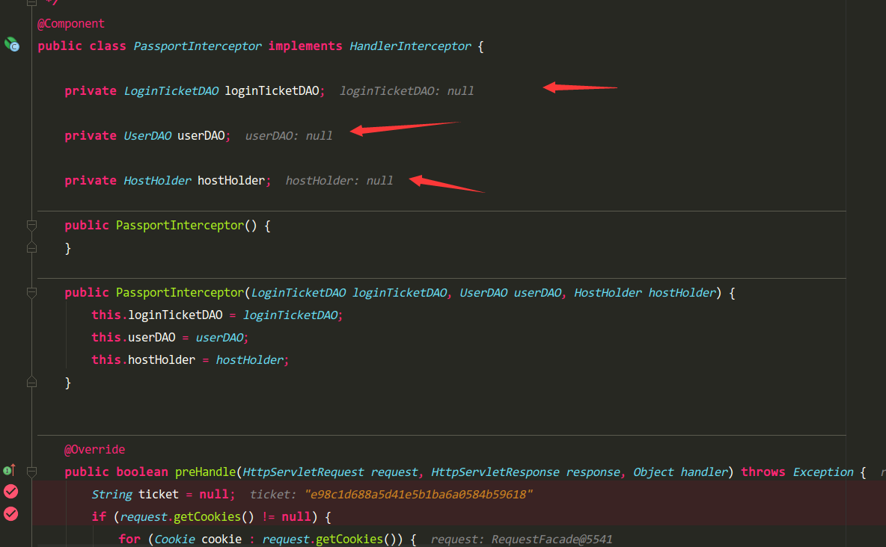

# wenda
使用SSM框架搭建仿知乎问答社区


##问题总结
1.
 ````
 /opt/jdk/1.8/bin/java -javaagent:/opt/idea-IU-171.4249.39/lib/idea_rt.jar=41203:/opt/idea-IU-171.4249.39/bin -Dfile.encoding=UTF-8 -classpath /opt/jdk/1.8/jre/lib/charsets.jar:/opt/jdk/1.8/jre/lib/deploy.jar:/opt/jdk/1.8/jre/lib/ext/cldrdata.jar:/opt/jdk/1.8/jre/lib/ext/dnsns.jar:/opt/jdk/1.8/jre/lib/ext/jaccess.jar:/opt/jdk/1.8/jre/lib/ext/jfxrt.jar:/opt/jdk/1.8/jre/lib/ext/localedata.jar:/opt/jdk/1.8/jre/lib/ext/nashorn.jar:/opt/jdk/1.8/jre/lib/ext/sunec.jar:/opt/jdk/1.8/jre/lib/ext/sunjce_provider.jar:/opt/jdk/1.8/jre/lib/ext/sunpkcs11.jar:/opt/jdk/1.8/jre/lib/ext/zipfs.jar:/opt/jdk/1.8/jre/lib/javaws.jar:/opt/jdk/1.8/jre/lib/jce.jar:/opt/jdk/1.8/jre/lib/jfr.jar:/opt/jdk/1.8/jre/lib/jfxswt.jar:/opt/jdk/1.8/jre/lib/jsse.jar:/opt/jdk/1.8/jre/lib/management-agent.jar:/opt/jdk/1.8/jre/lib/plugin.jar:/opt/jdk/1.8/jre/lib/resources.jar:/opt/jdk/1.8/jre/lib/rt.jar:/home/sunjianrong/IdeaProjects/wenda/target/classes:/home/sunjianrong/.m2/repository/org/springframework/boot/spring-boot-starter-aop/1.3.6.RELEASE/spring-boot-starter-aop-1.3.6.RELEASE.jar:/home/sunjianrong/.m2/repository/org/springframework/boot/spring-boot-starter/1.3.6.RELEASE/spring-boot-starter-1.3.6.RELEASE.jar:/home/sunjianrong/.m2/repository/org/springframework/boot/spring-boot-starter-logging/1.3.6.RELEASE/spring-boot-starter-logging-1.3.6.RELEASE.jar:/home/sunjianrong/.m2/repository/ch/qos/logback/logback-classic/1.1.7/logback-classic-1.1.7.jar:/home/sunjianrong/.m2/repository/ch/qos/logback/logback-core/1.1.7/logback-core-1.1.7.jar:/home/sunjianrong/.m2/repository/org/slf4j/slf4j-api/1.7.21/slf4j-api-1.7.21.jar:/home/sunjianrong/.m2/repository/org/slf4j/jcl-over-slf4j/1.7.21/jcl-over-slf4j-1.7.21.jar:/home/sunjianrong/.m2/repository/org/slf4j/jul-to-slf4j/1.7.21/jul-to-slf4j-1.7.21.jar:/home/sunjianrong/.m2/repository/org/slf4j/log4j-over-slf4j/1.7.21/log4j-over-slf4j-1.7.21.jar:/home/sunjianrong/.m2/repository/org/yaml/snakeyaml/1.16/snakeyaml-1.16.jar:/home/sunjianrong/.m2/repository/org/springframework/spring-aop/4.2.7.RELEASE/spring-aop-4.2.7.RELEASE.jar:/home/sunjianrong/.m2/repository/aopalliance/aopalliance/1.0/aopalliance-1.0.jar:/home/sunjianrong/.m2/repository/org/springframework/spring-beans/4.2.7.RELEASE/spring-beans-4.2.7.RELEASE.jar:/home/sunjianrong/.m2/repository/org/aspectj/aspectjweaver/1.8.9/aspectjweaver-1.8.9.jar:/home/sunjianrong/.m2/repository/org/mybatis/spring/boot/mybatis-spring-boot-starter/1.3.0/mybatis-spring-boot-starter-1.3.0.jar:/home/sunjianrong/.m2/repository/org/springframework/boot/spring-boot-starter-jdbc/1.3.6.RELEASE/spring-boot-starter-jdbc-1.3.6.RELEASE.jar:/home/sunjianrong/.m2/repository/org/apache/tomcat/tomcat-jdbc/8.0.36/tomcat-jdbc-8.0.36.jar:/home/sunjianrong/.m2/repository/org/apache/tomcat/tomcat-juli/8.0.36/tomcat-juli-8.0.36.jar:/home/sunjianrong/.m2/repository/org/springframework/spring-jdbc/4.2.7.RELEASE/spring-jdbc-4.2.7.RELEASE.jar:/home/sunjianrong/.m2/repository/org/springframework/spring-tx/4.2.7.RELEASE/spring-tx-4.2.7.RELEASE.jar:/home/sunjianrong/.m2/repository/org/mybatis/spring/boot/mybatis-spring-boot-autoconfigure/1.3.0/mybatis-spring-boot-autoconfigure-1.3.0.jar:/home/sunjianrong/.m2/repository/org/mybatis/mybatis/3.4.4/mybatis-3.4.4.jar:/home/sunjianrong/.m2/repository/org/mybatis/mybatis-spring/1.3.1/mybatis-spring-1.3.1.jar:/home/sunjianrong/.m2/repository/org/springframework/boot/spring-boot-starter-web/1.3.6.RELEASE/spring-boot-starter-web-1.3.6.RELEASE.jar:/home/sunjianrong/.m2/repository/org/springframework/boot/spring-boot-starter-tomcat/1.3.6.RELEASE/spring-boot-starter-tomcat-1.3.6.RELEASE.jar:/home/sunjianrong/.m2/repository/org/apache/tomcat/embed/tomcat-embed-core/8.0.36/tomcat-embed-core-8.0.36.jar:/home/sunjianrong/.m2/repository/org/apache/tomcat/embed/tomcat-embed-el/8.0.36/tomcat-embed-el-8.0.36.jar:/home/sunjianrong/.m2/repository/org/apache/tomcat/embed/tomcat-embed-logging-juli/8.0.36/tomcat-embed-logging-juli-8.0.36.jar:/home/sunjianrong/.m2/repository/org/apache/tomcat/embed/tomcat-embed-websocket/8.0.36/tomcat-embed-websocket-8.0.36.jar:/home/sunjianrong/.m2/repository/org/springframework/boot/spring-boot-starter-validation/1.3.6.RELEASE/spring-boot-starter-validation-1.3.6.RELEASE.jar:/home/sunjianrong/.m2/repository/org/hibernate/hibernate-validator/5.2.4.Final/hibernate-validator-5.2.4.Final.jar:/home/sunjianrong/.m2/repository/javax/validation/validation-api/1.1.0.Final/validation-api-1.1.0.Final.jar:/home/sunjianrong/.m2/repository/org/jboss/logging/jboss-logging/3.3.0.Final/jboss-logging-3.3.0.Final.jar:/home/sunjianrong/.m2/repository/com/fasterxml/classmate/1.1.0/classmate-1.1.0.jar:/home/sunjianrong/.m2/repository/com/fasterxml/jackson/core/jackson-databind/2.6.7/jackson-databind-2.6.7.jar:/home/sunjianrong/.m2/repository/com/fasterxml/jackson/core/jackson-annotations/2.6.7/jackson-annotations-2.6.7.jar:/home/sunjianrong/.m2/repository/com/fasterxml/jackson/core/jackson-core/2.6.7/jackson-core-2.6.7.jar:/home/sunjianrong/.m2/repository/org/springframework/spring-web/4.2.7.RELEASE/spring-web-4.2.7.RELEASE.jar:/home/sunjianrong/.m2/repository/org/springframework/spring-context/4.2.7.RELEASE/spring-context-4.2.7.RELEASE.jar:/home/sunjianrong/.m2/repository/org/springframework/spring-webmvc/4.2.7.RELEASE/spring-webmvc-4.2.7.RELEASE.jar:/home/sunjianrong/.m2/repository/org/springframework/spring-expression/4.2.7.RELEASE/spring-expression-4.2.7.RELEASE.jar:/home/sunjianrong/.m2/repository/org/springframework/boot/spring-boot-starter-velocity/1.3.6.RELEASE/spring-boot-starter-velocity-1.3.6.RELEASE.jar:/home/sunjianrong/.m2/repository/commons-beanutils/commons-beanutils/1.9.2/commons-beanutils-1.9.2.jar:/home/sunjianrong/.m2/repository/commons-collections/commons-collections/3.2.2/commons-collections-3.2.2.jar:/home/sunjianrong/.m2/repository/commons-digester/commons-digester/2.1/commons-digester-2.1.jar:/home/sunjianrong/.m2/repository/org/apache/velocity/velocity/1.7/velocity-1.7.jar:/home/sunjianrong/.m2/repository/commons-lang/commons-lang/2.4/commons-lang-2.4.jar:/home/sunjianrong/.m2/repository/org/apache/velocity/velocity-tools/2.0/velocity-tools-2.0.jar:/home/sunjianrong/.m2/repository/commons-chain/commons-chain/1.1/commons-chain-1.1.jar:/home/sunjianrong/.m2/repository/commons-validator/commons-validator/1.3.1/commons-validator-1.3.1.jar:/home/sunjianrong/.m2/repository/dom4j/dom4j/1.1/dom4j-1.1.jar:/home/sunjianrong/.m2/repository/oro/oro/2.0.8/oro-2.0.8.jar:/home/sunjianrong/.m2/repository/sslext/sslext/1.2-0/sslext-1.2-0.jar:/home/sunjianrong/.m2/repository/org/apache/struts/struts-core/1.3.8/struts-core-1.3.8.jar:/home/sunjianrong/.m2/repository/antlr/antlr/2.7.7/antlr-2.7.7.jar:/home/sunjianrong/.m2/repository/org/apache/struts/struts-taglib/1.3.8/struts-taglib-1.3.8.jar:/home/sunjianrong/.m2/repository/org/apache/struts/struts-tiles/1.3.8/struts-tiles-1.3.8.jar:/home/sunjianrong/.m2/repository/org/springframework/spring-context-support/4.2.7.RELEASE/spring-context-support-4.2.7.RELEASE.jar:/home/sunjianrong/.m2/repository/org/springframework/boot/spring-boot-devtools/1.3.6.RELEASE/spring-boot-devtools-1.3.6.RELEASE.jar:/home/sunjianrong/.m2/repository/org/springframework/boot/spring-boot/1.3.6.RELEASE/spring-boot-1.3.6.RELEASE.jar:/home/sunjianrong/.m2/repository/org/springframework/boot/spring-boot-autoconfigure/1.3.6.RELEASE/spring-boot-autoconfigure-1.3.6.RELEASE.jar:/home/sunjianrong/.m2/repository/mysql/mysql-connector-java/5.1.39/mysql-connector-java-5.1.39.jar:/home/sunjianrong/.m2/repository/org/springframework/spring-core/4.2.7.RELEASE/spring-core-4.2.7.RELEASE.jar com.suny.WendaApplication
 
   .   ____          _            __ _ _
  /\\ / ___'_ __ _ _(_)_ __  __ _ \ \ \ \
 ( ( )\___ | '_ | '_| | '_ \/ _` | \ \ \ \
  \\/  ___)| |_)| | | | | || (_| |  ) ) ) )
   '  |____| .__|_| |_|_| |_\__, | / / / /
  =========|_|==============|___/=/_/_/_/
  :: Spring Boot ::        (v1.3.6.RELEASE)
 
 2017-09-01 12:00:31.780  INFO 29101 --- [  restartedMain] com.suny.WendaApplication                : Starting WendaApplication on sunjianrong-CW65S with PID 29101 (/home/sunjianrong/IdeaProjects/wenda/target/classes started by sunjianrong in /home/sunjianrong/IdeaProjects/wenda)
 2017-09-01 12:00:31.785  INFO 29101 --- [  restartedMain] com.suny.WendaApplication                : No active profile set, falling back to default profiles: default
 2017-09-01 12:00:31.857  INFO 29101 --- [  restartedMain] ationConfigEmbeddedWebApplicationContext : Refreshing org.springframework.boot.context.embedded.AnnotationConfigEmbeddedWebApplicationContext@1e4f0276: startup date [Fri Sep 01 12:00:31 CST 2017]; root of context hierarchy
 2017-09-01 12:00:33.307 ERROR 29101 --- [  restartedMain] o.s.boot.SpringApplication               : Application startup failed
 
 java.lang.IllegalStateException: Cannot load configuration class: org.mybatis.spring.boot.autoconfigure.MybatisAutoConfiguration
 	at org.springframework.context.annotation.ConfigurationClassPostProcessor.enhanceConfigurationClasses(ConfigurationClassPostProcessor.java:416) ~[spring-context-4.2.7.RELEASE.jar:4.2.7.RELEASE]
 	at org.springframework.context.annotation.ConfigurationClassPostProcessor.postProcessBeanFactory(ConfigurationClassPostProcessor.java:263) ~[spring-context-4.2.7.RELEASE.jar:4.2.7.RELEASE]
 	at org.springframework.context.support.PostProcessorRegistrationDelegate.invokeBeanFactoryPostProcessors(PostProcessorRegistrationDelegate.java:284) ~[spring-context-4.2.7.RELEASE.jar:4.2.7.RELEASE]
 	at org.springframework.context.support.PostProcessorRegistrationDelegate.invokeBeanFactoryPostProcessors(PostProcessorRegistrationDelegate.java:130) ~[spring-context-4.2.7.RELEASE.jar:4.2.7.RELEASE]
 	at org.springframework.context.support.AbstractApplicationContext.invokeBeanFactoryPostProcessors(AbstractApplicationContext.java:678) ~[spring-context-4.2.7.RELEASE.jar:4.2.7.RELEASE]
 	at org.springframework.context.support.AbstractApplicationContext.refresh(AbstractApplicationContext.java:520) ~[spring-context-4.2.7.RELEASE.jar:4.2.7.RELEASE]
 	at org.springframework.boot.context.embedded.EmbeddedWebApplicationContext.refresh(EmbeddedWebApplicationContext.java:118) ~[spring-boot-1.3.6.RELEASE.jar:1.3.6.RELEASE]
 	at org.springframework.boot.SpringApplication.refresh(SpringApplication.java:760) [spring-boot-1.3.6.RELEASE.jar:1.3.6.RELEASE]
 	at org.springframework.boot.SpringApplication.createAndRefreshContext(SpringApplication.java:360) [spring-boot-1.3.6.RELEASE.jar:1.3.6.RELEASE]
 	at org.springframework.boot.SpringApplication.run(SpringApplication.java:306) [spring-boot-1.3.6.RELEASE.jar:1.3.6.RELEASE]
 	at org.springframework.boot.SpringApplication.run(SpringApplication.java:1185) [spring-boot-1.3.6.RELEASE.jar:1.3.6.RELEASE]
 	at org.springframework.boot.SpringApplication.run(SpringApplication.java:1174) [spring-boot-1.3.6.RELEASE.jar:1.3.6.RELEASE]
 	at com.suny.WendaApplication.main(WendaApplication.java:10) [classes/:na]
 	at sun.reflect.NativeMethodAccessorImpl.invoke0(Native Method) ~[na:1.8.0_91]
 	at sun.reflect.NativeMethodAccessorImpl.invoke(NativeMethodAccessorImpl.java:62) ~[na:1.8.0_91]
 	at sun.reflect.DelegatingMethodAccessorImpl.invoke(DelegatingMethodAccessorImpl.java:43) ~[na:1.8.0_91]
 	at java.lang.reflect.Method.invoke(Method.java:498) ~[na:1.8.0_91]
 	at org.springframework.boot.devtools.restart.RestartLauncher.run(RestartLauncher.java:49) [spring-boot-devtools-1.3.6.RELEASE.jar:1.3.6.RELEASE]
 Caused by: java.lang.IllegalStateException: Unable to load cache item
 	at org.springframework.cglib.core.internal.LoadingCache.createEntry(LoadingCache.java:79) ~[spring-core-4.2.7.RELEASE.jar:4.2.7.RELEASE]
 	at org.springframework.cglib.core.internal.LoadingCache.get(LoadingCache.java:34) ~[spring-core-4.2.7.RELEASE.jar:4.2.7.RELEASE]
 	at org.springframework.cglib.core.AbstractClassGenerator$ClassLoaderData.get(AbstractClassGenerator.java:116) ~[spring-core-4.2.7.RELEASE.jar:4.2.7.RELEASE]
 	at org.springframework.cglib.core.AbstractClassGenerator.create(AbstractClassGenerator.java:291) ~[spring-core-4.2.7.RELEASE.jar:4.2.7.RELEASE]
 	at org.springframework.cglib.proxy.Enhancer.createHelper(Enhancer.java:480) ~[spring-core-4.2.7.RELEASE.jar:4.2.7.RELEASE]
 	at org.springframework.cglib.proxy.Enhancer.createClass(Enhancer.java:337) ~[spring-core-4.2.7.RELEASE.jar:4.2.7.RELEASE]
 	at org.springframework.context.annotation.ConfigurationClassEnhancer.createClass(ConfigurationClassEnhancer.java:135) ~[spring-context-4.2.7.RELEASE.jar:4.2.7.RELEASE]
 	at org.springframework.context.annotation.ConfigurationClassEnhancer.enhance(ConfigurationClassEnhancer.java:107) ~[spring-context-4.2.7.RELEASE.jar:4.2.7.RELEASE]
 	at org.springframework.context.annotation.ConfigurationClassPostProcessor.enhanceConfigurationClasses(ConfigurationClassPostProcessor.java:406) ~[spring-context-4.2.7.RELEASE.jar:4.2.7.RELEASE]
 	... 17 common frames omitted
 Caused by: java.lang.NoClassDefFoundError: org/springframework/beans/factory/ObjectProvider
 	at java.lang.Class.getDeclaredConstructors0(Native Method) ~[na:1.8.0_91]
 	at java.lang.Class.privateGetDeclaredConstructors(Class.java:2671) ~[na:1.8.0_91]
 	at java.lang.Class.getDeclaredConstructors(Class.java:2020) ~[na:1.8.0_91]
 	at org.springframework.cglib.proxy.Enhancer.generateClass(Enhancer.java:566) ~[spring-core-4.2.7.RELEASE.jar:4.2.7.RELEASE]
 	at org.springframework.cglib.transform.TransformingClassGenerator.generateClass(TransformingClassGenerator.java:33) ~[spring-core-4.2.7.RELEASE.jar:4.2.7.RELEASE]
 	at org.springframework.cglib.core.DefaultGeneratorStrategy.generate(DefaultGeneratorStrategy.java:25) ~[spring-core-4.2.7.RELEASE.jar:4.2.7.RELEASE]
 	at org.springframework.context.annotation.ConfigurationClassEnhancer$BeanFactoryAwareGeneratorStrategy.generate(ConfigurationClassEnhancer.java:249) ~[spring-context-4.2.7.RELEASE.jar:4.2.7.RELEASE]
 	at org.springframework.cglib.core.AbstractClassGenerator.generate(AbstractClassGenerator.java:329) ~[spring-core-4.2.7.RELEASE.jar:4.2.7.RELEASE]
 	at org.springframework.cglib.proxy.Enhancer.generate(Enhancer.java:492) ~[spring-core-4.2.7.RELEASE.jar:4.2.7.RELEASE]
 	at org.springframework.cglib.core.AbstractClassGenerator$ClassLoaderData$3.apply(AbstractClassGenerator.java:93) ~[spring-core-4.2.7.RELEASE.jar:4.2.7.RELEASE]
 	at org.springframework.cglib.core.AbstractClassGenerator$ClassLoaderData$3.apply(AbstractClassGenerator.java:91) ~[spring-core-4.2.7.RELEASE.jar:4.2.7.RELEASE]
 	at org.springframework.cglib.core.internal.LoadingCache$2.call(LoadingCache.java:54) ~[spring-core-4.2.7.RELEASE.jar:4.2.7.RELEASE]
 	at java.util.concurrent.FutureTask.run(FutureTask.java:266) ~[na:1.8.0_91]
 	at org.springframework.cglib.core.internal.LoadingCache.createEntry(LoadingCache.java:61) ~[spring-core-4.2.7.RELEASE.jar:4.2.7.RELEASE]
 	... 25 common frames omitted
 Caused by: java.lang.ClassNotFoundException: org.springframework.beans.factory.ObjectProvider
 	at java.net.URLClassLoader.findClass(URLClassLoader.java:381) ~[na:1.8.0_91]
 	at java.lang.ClassLoader.loadClass(ClassLoader.java:424) ~[na:1.8.0_91]
 	at sun.misc.Launcher$AppClassLoader.loadClass(Launcher.java:331) ~[na:1.8.0_91]
 	at java.lang.ClassLoader.loadClass(ClassLoader.java:357) ~[na:1.8.0_91]
 	... 39 common frames omitted
 
 2017-09-01 12:00:33.311  INFO 29101 --- [  restartedMain] .b.l.ClasspathLoggingApplicationListener : Application failed to start with classpath: [file:/home/sunjianrong/IdeaProjects/wenda/target/classes/]
 
 Process finished with exit code 0

 ````
 
 2.数据库手动写sql语句注意
 - 注释 COMMENT后使用单引号'
 - 字段,表名需要括起来就是用反单引号`,也就是数字键1旁边的键位
 
 3.无法插入数据问题  
 ```
  sql> INSERT INTO question (id, title, content, user_id, created_date, comment_count)
  VALUES (
    NULL, "如何看待知乎的行为", '无法看待', 10000, CURRENT_TIMESTAMP(), 55)
  [2017-09-02 23:40:08] [HY000][1366] Incorrect string value: '\xE5\xA6\x82\xE4\xBD\x95...' for column 'title' at row 1
  [2017-09-02 23:40:08] [HY000][1366] Incorrect string value: '\xE6\x97\xA0\xE6\xB3\x95...' for column 'content' at row 1
  [2017-09-02 23:40:08] [HY000][1366] Incorrect string value: '\xE5\xA6\x82\xE4\xBD\x95...' for column 'title' at row 1
 ```
 看起来就是应该是中文才插不进去,然后我想起课程里面的sq代码是没有指定字符集的,而是默认的字符集,首先先选择需要更改编码的数据,然后使用mysql的查看字符集指令
 `show variables like 'character%';
我这边跑出来的是一下的结果
````
+--------------------------+----------------------------+
| Variable_name            | Value                      |
+--------------------------+----------------------------+
| character_set_client     | utf8                       |
| character_set_connection | utf8                       |
| character_set_database   | utf8                       |
| character_set_filesystem | binary                     |
| character_set_results    | utf8                       |
| character_set_server     | latin1                     |
| character_set_system     | utf8                       |
| character_sets_dir       | /usr/share/mysql/charsets/ |
+--------------------------+----------------------------+
````
我们可以看到`character_set_server`的编码是**latin1**,然后我们先修改编码,使用
`set character_set_server =utf8`更改`character_set_server`的编码,然后查看结果
````
+--------------------------+----------------------------+
| Variable_name            | Value                      |
+--------------------------+----------------------------+
| character_set_client     | utf8                       |
| character_set_connection | utf8                       |
| character_set_database   | utf8                       |
| character_set_filesystem | binary                     |
| character_set_results    | utf8                       |
| character_set_server     | utf8                       |
| character_set_system     | utf8                       |
| character_sets_dir       | /usr/share/mysql/charsets/ |
+--------------------------+----------------------------+
````
可以看到这里是已经更改好了的,然后我继续插入数据,还是失败了,只有手动删表,然后再建表的时候自己设置下编码,根据资料里面的SQL脚本为
````sql
CREATE TABLE `question` (
  `id`            INT          NOT NULL AUTO_INCREMENT,
  `title`         VARCHAR(255) NOT NULL,
  `content`       TEXT         NULL,
  `user_id`       INT          NOT NULL,
  `created_date`  DATETIME     NOT NULL,
  `comment_count` INT          NOT NULL,
  PRIMARY KEY (`id`),
  INDEX `date_index` (`created_date` ASC)
)
````
我这里需改为下面的之后再重新插入是没用问题的
````sql
CREATE TABLE `question` (
  `id`            INT          NOT NULL AUTO_INCREMENT,
  `title`         VARCHAR(255) NOT NULL,
  `content`       TEXT         NULL,
  `user_id`       INT          NOT NULL,
  `created_date`  DATETIME     NOT NULL,
  `comment_count` INT          NOT NULL,
  PRIMARY KEY (`id`),
  INDEX `date_index` (`created_date` ASC)
)
  ENGINE = InnoDB
  DEFAULT CHARSET = UTF8 COMMENT '问题表';
````
增加的内容为:
- `ENGINE = InnoDB`:数据库引擎,**InnoDB**是支持事物,外键关联,行级锁的
- `DEFAULT CHARSET = UTF8`:手动设置数据库编码,不适用默认编码

4.Chrome提交表单报错
```
An invalid form control with name='' is not focusable.
```

5.拦截器中无法注入bean
原来的代码

把原来的构造方法注入修改成以下的代码就可以正常注入,
```java
@Component
public class PassportInterceptor implements HandlerInterceptor {

    @Autowired
    private LoginTicketDAO loginTicketDAO;
    @Autowired
    private UserDAO userDAO;
    @Autowired
    private HostHolder hostHolder;
```

6.sql语句报错
在mapper中的写法是这样,注意看**from**跟**where**前面是没有空格的
```java
@Select({"select", SELECT_FIELDS + "from " + TABLE_NAME + "where ticket=#{ticket}"})
```
控制台报错出来的语句
```
### SQL: select id user_id, expired, status, ticketfrom login_ticketwhere ticket=?
```
不是我们预想的那样,于是把mapper中的语句改成下面这样就不报错了
````java
@Select({"select", SELECT_FIELDS + " from " + TABLE_NAME + " where ticket=#{ticket}"})
````


